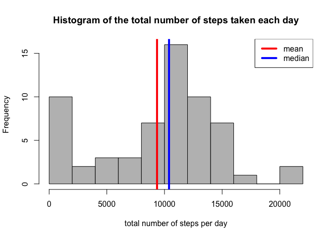
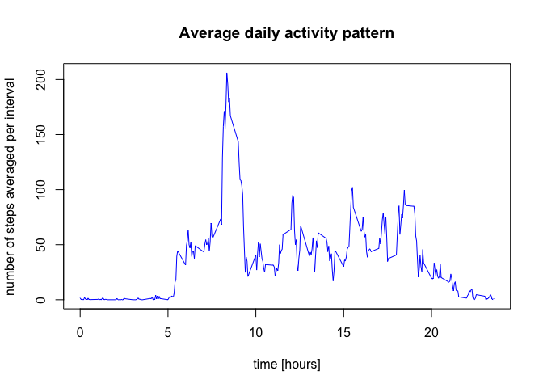
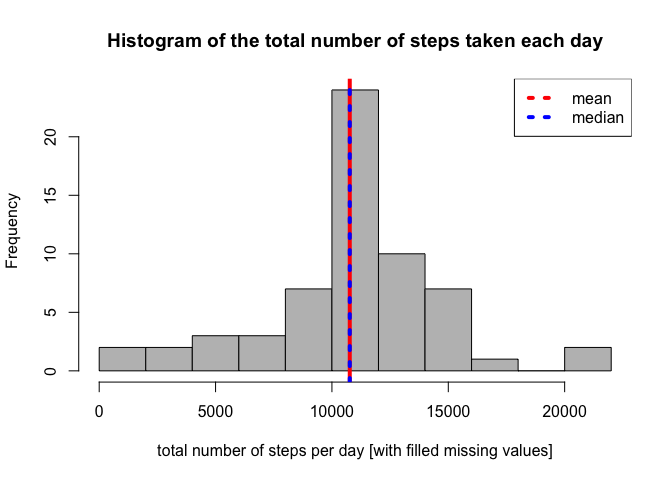
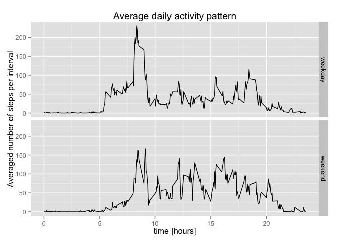

# Reproducible Research: Peer Assessment 1


## Loading and preprocessing the data
The data file `activity.csv` is extracted from the compressed file `activity.zip` and then loaded into the data frame data. The data are formated in order to assign the class "Date" to the coloumn with the dates. The structure of the data frame and a summary statistic are shown below.

```r
data <- read.csv( unz("activity.zip", "activity.csv"), na.string = "NA",
                  colClasses=c("integer", "Date", "integer"))
str(data)
```

```
## 'data.frame':	17568 obs. of  3 variables:
##  $ steps   : int  NA NA NA NA NA NA NA NA NA NA ...
##  $ date    : Date, format: "2012-10-01" "2012-10-01" ...
##  $ interval: int  0 5 10 15 20 25 30 35 40 45 ...
```

```r
head(data)
```

```
##   steps       date interval
## 1    NA 2012-10-01        0
## 2    NA 2012-10-01        5
## 3    NA 2012-10-01       10
## 4    NA 2012-10-01       15
## 5    NA 2012-10-01       20
## 6    NA 2012-10-01       25
```

## What is mean total number of steps taken per day?
The total number of steps taken per day is obtained using the `tapply` function. The mean and median are also displaied.

```r
step_per_day <- tapply(data$steps, data$date, sum, na.rm = TRUE)
step_mean <- mean(step_per_day)
step_mean
```

```
## [1] 9354.23
```

```r
step_median <- median(step_per_day)
step_median
```

```
## [1] 10395
```

The histogram of the total number of steps taken each day is displaied below. The mean and the median are also displaied with two vertical lines.

```r
hist(step_per_day, col = "grey", breaks=11,
     xlab = "total number of steps per day",
     main = "Histogram of the total number of steps taken each day")
abline(v = step_mean, col = "red", lwd = 4)
abline(v = step_median, col = "blue", lwd = 4)
legend(x = "topright", bty="l", legend=c("mean","median"), col = c("red","blue"), lwd=4)
```

 

## What is the average daily activity pattern?
The average number of steps taken for each 5-minutes interval, averaged over all days, is obtained using again the `tapply` function. Then, the average daily activity pattern is plotted as a time series. The x-label is formatted as "%H:%M" instead of the initial "%H%M".

```r
avg_steps <- tapply(data$steps, data$interval, mean, na.rm = TRUE)
hours <- as.numeric(names(avg_steps)) / 100
plot(hours, avg_steps, type="l", col = "blue",
     xlab = "time [hours]", ylab = "number of steps averaged per interval",
     main = "Average daily activity pattern")
```

 

The 5-minute intervals, on average across all the days in the dataset, that contains the maximum number of steps, starts at

```r
max_idx <- which( avg_steps == max(avg_steps) )       # index of the maximum interval
max_int <- as.numeric(names( avg_steps[max_idx] ) )   # maximum interval
sprintf("%02d:%02d", floor(max_int/100), max_int %% 100)
```

```
## [1] "08:35"
```

## Imputing missing values

The total number of observation with missing values in the dataset (i.e. the total number of rows with NAs) is calculated and reported below.

```r
ok  <- complete.cases(data)
num_na <- sum(!ok)
num_na
```

```
## [1] 2304
```

To fill in the 2304 missing values in the dataset, the mean for that 5-minute interval is used. A new dataset called `data2` is then created, the structure and a summary are reported below.

```r
data2 <- data
aux <- tapply(data2$step,data2$interval)
for (i in c(1:288)){
    if (sum(aux == i & !ok) > 0){
        data2$steps[ aux == i & !ok] <- avg_steps[i]
    }
}
str(data2)
```

```
## 'data.frame':	17568 obs. of  3 variables:
##  $ steps   : num  1.717 0.3396 0.1321 0.1509 0.0755 ...
##  $ date    : Date, format: "2012-10-01" "2012-10-01" ...
##  $ interval: int  0 5 10 15 20 25 30 35 40 45 ...
```

```r
summary(data2)
```

```
##      steps             date               interval     
##  Min.   :  0.00   Min.   :2012-10-01   Min.   :   0.0  
##  1st Qu.:  0.00   1st Qu.:2012-10-16   1st Qu.: 588.8  
##  Median :  0.00   Median :2012-10-31   Median :1177.5  
##  Mean   : 37.38   Mean   :2012-10-31   Mean   :1177.5  
##  3rd Qu.: 27.00   3rd Qu.:2012-11-15   3rd Qu.:1766.2  
##  Max.   :806.00   Max.   :2012-11-30   Max.   :2355.0
```

For the new dataset, the total number of steps taken per day, its mean and median are calculated and reported below.

```r
step_per_day2 <- tapply(data2$steps, data2$date, sum, na.rm = TRUE)
step_mean2 <- mean(step_per_day2)
step_mean2
```

```
## [1] 10766.19
```

```r
step_median2 <- median(step_per_day2)
step_median2
```

```
## [1] 10766.19
```

The histogram of the total number of steps taken each day is displaied below. The mean and the median are also displaied with two vertical lines.

```r
hist(step_per_day2, col = "grey", breaks=11, 
     xlab = "total number of steps per day [with filled missing values]",
     main = "Histogram of the total number of steps taken each day")
abline(v=step_mean2, col = "red", lwd = 4 )
abline(v=step_median2, col = "blue", lwd = 4, lty = 3)
legend(x="topright",  bty="l", legend=c("mean","median"), col=c("red","blue"), lwd = 4, lty = 3)
```

 

The new estimates for the mean and median differs from the computed previous ones. By imputing missing data on the estimates of the total daily number of steps, we increase the estimates for the mean value and for the median. The mean increased of 13.11%, while the median of only 3.45%.

## Are there differences in activity patterns between weekdays and weekends?
First, I create new factor variable in the dataset with two levels – ``weekday'' and ``weekend'' indicating whether a given date is a weekday (Monday to Friday) or a weekend day (Saturday and Sunday):

```r
data2$week <- factor(weekdays(data2$date) %in% c("Saturday","Sunday"), 
                     labels=c("weekday","weekend"), ordered = FALSE)
```

Second, the average number of steps taken over each 5-minutes interval, averaged across all weekday days or weekend days, is computed as follows:

```r
avg_steps2 <- aggregate( data2$steps, by = with(data2, list( interval=interval, week=week)), mean)
```

A panel plot containing a time series plot (i.e. type = "l") of the 5-minute interval (x-axis) and the average number of steps taken, averaged across all weekday days or weekend days (y-axis) is shown below.

```r
library(ggplot2)
g <- ggplot( avg_steps2, aes( interval/100, x ))
g + geom_line() + facet_grid( week ~ .) +
    labs(x = "time [hours]") +
    labs(y = "Averaged number of steps per interval") +
    labs(title = "Average daily activity pattern")
```

 
